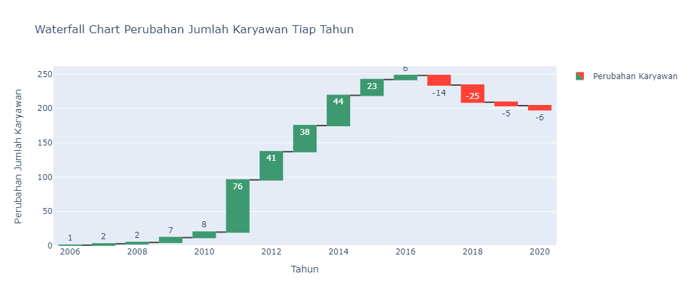
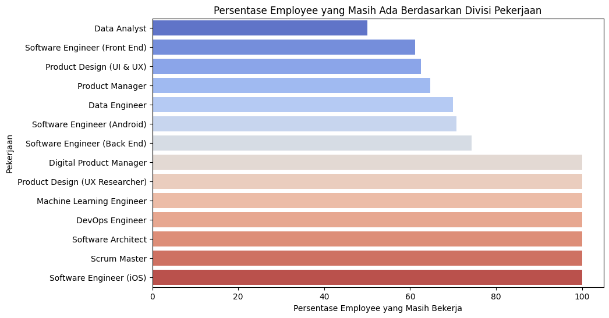
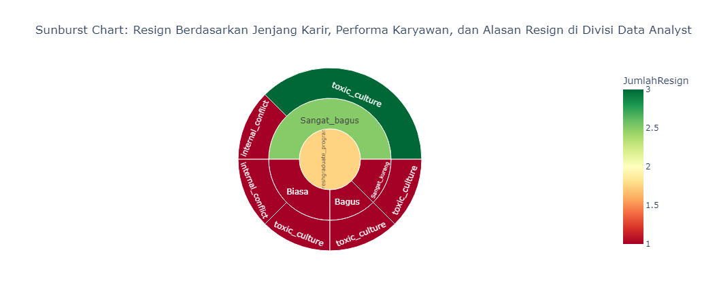
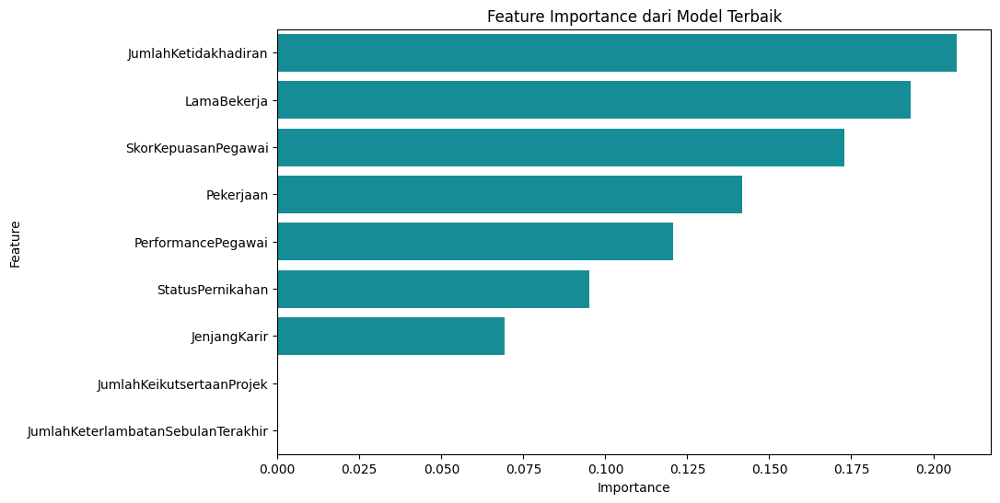

# Employee Attrition Prediction
Improving Employee Retention by Predicting Employee Attrition Using Machine Learning

## Project Overview
In this project, I work as a member of the Data Scientist team in a tech start-up company. The company is currently hit by a big problem, many employees have submitted resignations but the company has not yet made a decision on it. I was requested to help the company to explain the current condition of its employees, as well as explore the problems within the company that caused the employees to resign so as to reduce the resignation rate of employees, and be able to outline a strategy that can increase the retention of employees. I was asked to present descriptive findings from the data using data visualization and data storytelling.

## Table of Contents
1. [Business Problem](#business-problem)
2. [Objective](#objective)
3. [Data](#data)
4. [Annual Report on Employee Number Changes](#annual-report-on-employee-number-changes)
5. [Resign Reason Analysis for Employee Attrition Management Strategy](#resign-reason-analysis-for-employee-attrition-management-strategy)
6. [Data Preprocessing](#data-preprocessing)
7. [Machine Learning Modeling](#machine-learning-modeling)
8. [Model Evaluation](#model-evaluation)
9. [Hyperparameter Tuning](#hyperparameter-tuning)
10. [Feature Importance](#feature-importance)
11. [Business Recommendations](#business-recommendations)

## Business Problem
The company was struggling to retain employees, with high resignation rates affecting productivity as well as operational costs. The company needed an in-depth analysis to understand the factors contributing to employees' decision to resign and develop strategies to improve retention rates.

## Objective
The objectives of this project are to predict potential employee resignation using machine learning, identify key factors that cause employees to resign, and develop strategy recommendations to improve employee retention in the company.

## Data
[The dataset](data/Improving%20Employee%20Retention%20by%20Predicting%20Employee%20Attrition%20Using%20Machine.csv) used in this project contains employee data. The attributes in this dataset are Username,EnterpriseID,StatusPernikahan,JenisKelamin,StatusKepegawaian,Pekerjaan,JenjangKarir,PerformancePegawai,AsalDaerah,HiringPlatform,SkorSurveyEngagement,SkorKepuasanPegawai,JumlahKeikutsertaanProjek,JumlahKeterlambatanSebulanTerakhir,JumlahKetidakhadiran,NomorHP,Email,TingkatPendidikan,PernahBekerja,IkutProgramLOP,AlasanResign,TanggalLahir,TanggalHiring,TanggalPenilaianKaryawan,TanggalResign.

## Annual Report on Employee Number Changes
A visualization chart showing the changes in the increase and decrease in the number of employees in each year is shown in the following chart.

Based on the visualization results, the following insights were discovered.
- A consistent number of employees decreasing over several years indicates that the company may be facing internal or external challenges. This could be a problem in human resource management, a less supportive work environment, or pressure from competitors in the market.

- The massive growth that happened in 2011-2012 is likely related to the expansion or large projects that the company was undertaking at the time. However, companies should be careful to maintain a balance between expansion and retaining existing human resources.

- With the decreasing trend of employees since 2016, the company's condition can be said to be worrying. This could affect the company's operational stability in the long run. Management needs to focus on recovering headcount and improving the company's internal conditions.

- After seeing a significant decrease in number of employees, especially in 2017, the company should re-evaluate its employee retention policy. Programs to improve job satisfaction, adjust remuneration, or review work culture may need to be considered to prevent losing more employees in the future.

## Resign Reason Analysis for Employee Attrition Management Strategy
The following graph displays the percentage of existing employees by job division

A graph showing the visualization of the number of resignations based on Career Level, Employee Performance, and Reason for Resignation in the Data Analyst Division (Division with the highest resignation rate) is shown in the following graph.

Based on the visualization results, the insights that can be found are as follows.
- The majority of employees in the Data Analyst division who resigned came from Very Good and Good career paths, while those with Ordinary career paths also contributed a significant number of resignations. Very Good employees are probably senior employees who have been working for a long time and there could be a special reason why they resigned.

- Good and Very Good performers are the ones who resigned. This could indicate that the problem lies not in the employee's performance, but in other factors beyond employability.

- Toxic Culture and Internal Conflict are the dominant reasons at every performance level, especially at the Good and Ordinary levels. This indicates that a less conducive work environment is a big problem in this division.

## Data Preprocessing
In the data cleaning and preprocessing stage, several processes are carried out, including the following.
- **Quick EDA:** Checking the information on datasets, columns, statistical summaries, missing values, and duplicate data.

- **Handling Data Null:** Missing values in the SkorKepuasanPegawai, JumlahKeikutsertaanProjek, JumlahKeterlambatanSebulanTerakhir, and JumlahKetidakhadiran features will be filled using the mode. Missing values in the AlasanResign feature will be filled in as masih_bekerja because the TanggalResign feature is still empty (no date yet).

- **Drop Features:** Remove unnecessary features and features that have too many missing values are 'Username', 'EnterpriseID', 'PernahBekerja', and 'IkutProgramLOP’.

- **Handling Outlier:** Replacing the outlier value with the maximum limit. 

- **Feature Encoding:** Performs label encoding for the features Marital Status, Gender, Employment Status, Job, Career Level, Employee Performance, Regional Origin, HiringPlatform, Education Level, Reason for Design.

- **Feature Engineering:** Creating new features such as LamaBekerja and Resign.

- **Feature Selection:** Select features that will be used in the machine learning model training process. These features are Pekerjaan, JenjangKarir, PerformancePegawai, LamaBekerja, JumlahKeikutsertaanProjek, JumlahKeterlambatanSebulanTerakhir, JumlahKetidakhadiran, SkorKepuasanPegawai, StatusPernikahan.

- **Standardization :** Performs a standardization process for each numerical feature. This is used to improve the performance of the model.

## Machine Learning Modeling
Before training the model, split the data into train set and test set (size is 20%). Then perform the process of handling imbalanced data using SMOTE. Train the model with 4 different algorithms.The three algorithms used are as follows.
- Logistic Regression
- Random Forest
- Decision Tree
- K-Nearest Neighbors

## Model Evaluation
| Model | Accuracy | Precision | Recall | F1-Score |
| ------------- |:-------------:|:-------------:|:-------------:|:-------------:|
| Logistic Regression   | 0.482759 | 0.238095 | 0.263158 | 0.250000 |
| Random Forest         | 0.637931 | 0.375000 | 0.157895 | 0.222222 |
| Decision Tree         | 0.517241 | 0.235294 | 0.210526 | 0.222222 |
| K-Nearest Neighbors   | 0.517241 | 0.333333 | 0.473684 | 0.391304 |

## Hyperparameter Tuning
Based on the evaluation results, it is found that the best model is Random Forest. This best model will be hyperparameter tuning using GridSearchCV. 

The results of hyperparameter tuning are as follows.
- Accuracy	: 0.655172
- Precision	: 0.444444
- Recall	: 0.210526
- F1 Score	: 0.285714

## Feature Importance
The graph that shows the visualization of the feature importance of the model that has been done hyperparameter tuning is shown in the following graph.

Based on the feature importance graph, the insights are as follows.
- The Number of Absences (JumlahKetidakhadiran) feature is the most significant in influencing the prediction of resignation. High employee absenteeism indicates disengagement or potential well-being issues.

- The longer employees work, the higher their risk of resignation. This could be related to burnout or lack of career development opportunities.

- Employee satisfaction levels directly influence the decision to stay or resign. Employees who feel less satisfied are more likely to leave the company.

- An employee's job or role in the company also affects the risk of resignation. Certain positions may have a higher workload or pressure.

- Employees with good performance may feel undervalued if they are not rewarded accordingly.

## Business Recommendations
Based on the insights obtained, the following business recommendations can be given.
- **Improve Employee Well-Being Programs**, the company need to focus on reducing absenteeism by offering mental health programs, counseling sessions, and work flexibility.

- **Career Development**, the company should provide transparent career paths, promotion opportunities, and job rotations for long-serving employees to maintain motivation and avoid burnout.

- **Monitoring and Improving Job Satisfaction**, the company should conduct regular employee satisfaction surveys and follow up the results with improvements to the work environment and policies that support work-life balance.

- **Evaluate Workload and Support in Each Job**, the company need to conduct a workload analysis in each position to ensure that no employee feels overburdened. Add support or resources as needed.

- **Rewards for High Performing Employees**, the company need to implement reward and recognition programs for employees who perform well to keep them motivated and engaged with the company.

